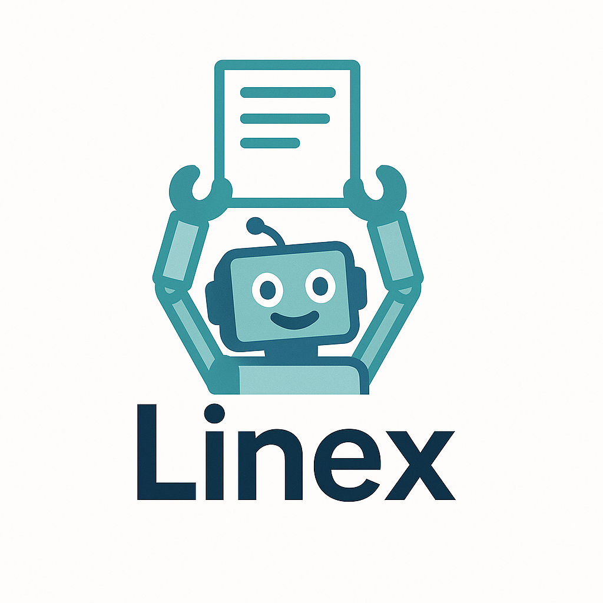

# Linex

**LLM-friendly metadata & dependency management platform for modern TypeScript projects**

---



## Overview


Linex is a next-generation platform library and CLI tool that enables real-time, LLM-friendly management of project objects, components, schemas, and dependencies.  
It is designed to solve the complexity of dependency tracking, documentation, and automation in large-scale frontend and backend projects.  
Linex integrates with CLI and MCP (Agent) systems to support live documentation, guides, and workflow automation.

---

## What Problem Does Linex Solve?

- **Complex dependency management:** Makes it easy to track, visualize, and update dependencies in large projects.
- **LLM-ready metadata:** Automatically wraps and transforms your schemas/components/objects for better LLM (Large Language Model) understanding and automation.
- **Live documentation and guides:** Keeps documentation and usage guides up-to-date as your code changes.
- **Developer productivity:** Automates repetitive tasks and reduces manual documentation/maintenance overhead.

---

## Key Features

- **LLM-Friendly Metadata Wrapping:**  
  Automatically transforms existing schemas, components, and objects into rich, LLM-understandable metadata.
- **Real-time File Watching & Hot Reload:**  
  Automatically updates metadata and dependencies on code/schema/component changes.
- **Powerful CLI Tool:**
  - `linex list` – List all registered objects, schemas, components, and dependencies
  - `linex show [name]` – Display detailed metadata, documentation, and relationships
  - `linex deps` – Visualize the dependency tree
  - `linex watch` – Real-time file watching and hot reload
  - `linex mcp [name]` – Connect with MCP/Agent for official docs/guides
- **MCP/Agent Integration:**  
  Seamless integration with tools like context7, taskmaster for documentation, guides, and automation feedback.
- **TypeScript-first, with built-in testing, linting, and CI**

---

## User Experience

- **Target Users:**
  - Developers in large-scale frontend/backend projects
  - Teams needing LLM-based automation, documentation, and dependency management
- **Typical Workflow:**
  1. Wrap schemas/components/objects with Linex
  2. Use the CLI to check real-time status, dependencies, and documentation
  3. Leverage MCP/Agent for official docs, guides, and automation feedback
- **UI/UX Considerations:**
  - Intuitive CLI commands
  - (Planned) Web dashboard
  - Real-time feedback and notifications

---

## Technical Architecture

- **Core Components:**
  - `core`: LLM-friendly wrappers, dependency management
  - `cli`: Command-line interface
  - `watcher`: File watching & hot reload
  - `mcp`: MCP/Agent integration
- **Data Models:**
  - `LinexMeta`: LLM-friendly metadata object
  - `DependencyGraph`: Dependency tree representation
- **Infrastructure Requirements:**
  - Node.js 18+
  - TypeScript 5.x+

---

## Development Roadmap

- **MVP:**
  - LLM-friendly wrapper functions
  - CLI commands: list, show, deps, watch
  - File watching & hot reload
  - MCP integration (basic)
  - Testing, documentation, CI
- **Future Expansion:**
  - Web dashboard
  - REST/GraphQL API
  - More MCP/Agent integrations
  - Plugin system

---

## Logical Dependency Chain

1. Implement LLM-friendly wrappers and data models
2. Build CLI commands and dependency tree management
3. Add file watching and hot reload
4. Integrate with MCP/Agent
5. Add testing, documentation, and CI
6. Expand with dashboard, API, plugins, etc.

---

## Risks & Mitigation

- **Technical complexity:**
  - LLM-friendly automation accuracy → Iterative testing/feedback
- **MCP/Agent integration:**
  - Compatibility with official docs/guides → Standardized interface design
- **Scalability:**
  - Performance in large projects → Modularization and optimization

---

## Project Quality

- **TypeScript 5.x, strict typing**
- **ESM modules**
- **Jest/Vitest for testing**
- **ESLint, Prettier for linting and formatting**
- **GitHub Actions for CI**
- **Thoughtful directory structure and code quality for easy maintenance**

---

## Getting Started

```bash
# Install dependencies
npm install

# Build the project
npm run build

# Run tests
npm run test

# Try the CLI (after build)
linex demo-complex
linex list
linex show [name]
linex deps
linex watch
```

---

## CLI Reference

| Command              | Description                                                                                                                                                                                                                    |
| -------------------- | ------------------------------------------------------------------------------------------------------------------------------------------------------------------------------------------------------------------------------ |
| `linex list`         | List all registered objects/schemas/etc. <br>Options:<br> `-t, --type <type>` (schema, component, object)<br> `-f, --format <format>` (table, json) – default: `table`<br> `-s, --sort <field>` (name, type) – default: `name` |
| `linex show <name>`  | Show detailed info for a specific object <br>Options:<br> `-f, --format <format>` (text, json) – default: `text`<br> `-d, --dependencies` – show dependencies<br> `-r, --dependents` – show dependents                         |
| `linex deps`         | Visualize dependency tree <br>Options:<br> `-n, --name <name>` – focus on specific object<br> `-d, --depth <depth>` – max depth (default: 3)<br> `-f, --format <format>` (tree, dot, json) – default: `tree`                   |
| `linex watch`        | Watch files for changes (hot reload) <br>Options:<br> `--entry <file>` – entry file to start watching (default: `src/index.ts`)                                                                                                |
| `linex demo-complex` | Register a complex demo dataset                                                                                                                                                                                                |

For more, run `linex --help`.

---

## Example Directory Structure

```
src/
  core/         # Core logic (wrappers, registry, graph)
  cli/          # CLI commands and utilities
  watcher/      # File watcher system
  mcp/          # MCP/Agent integration
  demo/         # Demo data and complex examples
  __test__/     # Unit tests
```

---

## References

- [context7](https://github.com/context7)
- [taskmaster](https://github.com/taskmaster)
- Babel, Storybook, Zod (for inspiration)

---

## License

MIT

---

**Linex** is designed for teams that want to supercharge their project’s automation, documentation, and dependency management in the LLM era.  
Feel free to use, contribute, and reach out for any questions!
